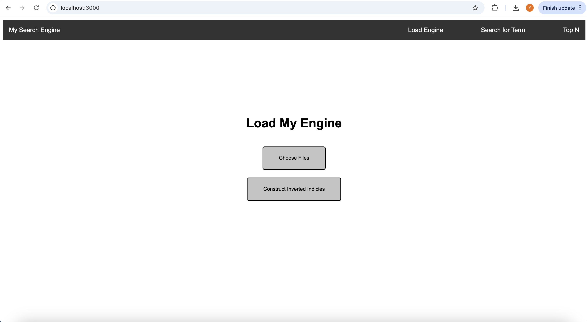
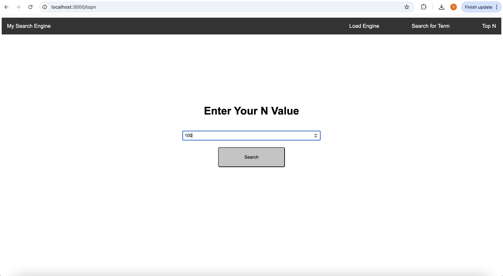
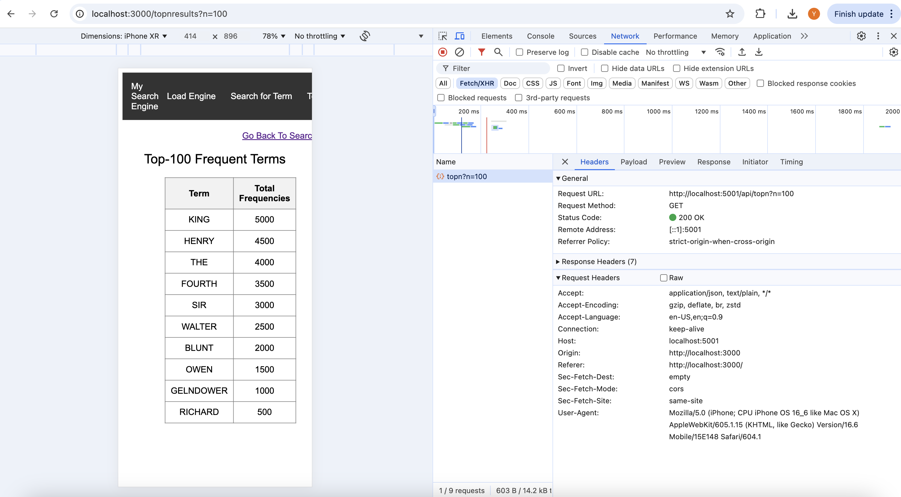

[](https://classroom.github.com/a/pLRyr-9g)
### Team Project Members: Oscar Xue, Yifan(Judy) Zhang
---
# Video For Code Walkthrough & Functionality Demo
Here is the Public Google Drive Video File:
https://drive.google.com/file/d/1XxIUcKQEmsX6yicUT4lFsMcNvcvT9sA7/view?usp=sharing

In case the .mov format video does not work, there is another .mp4 format video with same content:
https://drive.google.com/file/d/1mAAeTmaXGvI4fI9UCUUpJntgIWpWJ9qs/view?usp=sharing

# Cluster Set Up
In the infra directory, run
```sh
terraform init
terraform apply
```
to create the cluster. Terraform automatically creates the GKE cluster, deploys Kafka, creates topics, deploys the spark app, and outputs the external IP of the Kafka load balancer.

# Lightweight Application Set Up
## 1. SE-Server

### Project Setup
Inject the external IP of load balancer in the BROKER variable, then
```sh
pip install -r requirements.txt
```

### Compile and Hot-Reload for Development
```sh
flask run --port=5001
```

### Dockerize the Application

#### Building the Container
```sh
docker buildx build --platform linux/amd64 -f Dockerfile -t $DOCKER_USER_ID/se-server .
```

#### Running the Container
```sh
docker run -d -p 5001:5001 $DOCKER_USER_ID/se-server
```

#### Pushing the container
```sh
docker push $DOCKER_USER_ID/se-server
```

## 2. SE-Frontend

This template should help get you started developing with Vue 3 in Vite.

### Recommended IDE Setup

[VSCode](https://code.visualstudio.com/) + [Volar](https://marketplace.visualstudio.com/items?itemName=Vue.volar) (and disable Vetur).

### Customize configuration

See [Vite Configuration Reference](https://vitejs.dev/config/).

### Project Setup
Inject the endpoint of 
```sh
npm install
```

#### Compile and Hot-Reload for Development

```sh
npm run dev
```

#### Compile and Minify for Production

```sh
npm run build
```

### Dockerize the Application

#### Building the Container
```sh
docker buildx build --platform linux/amd64 -f Dockerfile -t $DOCKER_USER_ID/se-frontend .
```

#### Running the Container
```sh
docker run -p 3000:3000 $DOCKER_USER_ID/se-frontend
```

#### Pushing the container
```sh
docker push $DOCKER_USER_ID/se-frontend
```


# Checkpoint Demonstration
For our project, we have successfully built the first web application. At this stage, we have developed a functional app that includes both the user interface and backend (currently using mocked data). Additionally, we have created a Docker container and deployed the application within it. The application is fully operational when run in the Docker container.

## 1. Application Home Page


## 2. Example User Input Page for Top N 
We have built the user input pages for Top N and Search for Term.


## 3. Example Response Page for Top N 
As shown by the below image, the frontend is making a request to the server, and is getting a 200 ok response.


---
# Reference
1. Spark and Kafka: https://spark.apache.org/docs/3.5.1/structured-streaming-kafka-integration.html
2. Kafka message size: https://www.confluent.io/learn/kafka-message-size-limit/#default-size-limit
3. Spark Inverted Index: https://stackoverflow.com/questions/47657531/pyspark-inverted-index
4. Spark Top N: https://stackoverflow.com/questions/38397796/retrieve-top-n-in-each-group-of-a-dataframe-in-pyspark
5. Spark Inverted Index: https://github.com/abhishek-kathuria/Big-Data-Spark-Inverted-Index
6. NLTK stop words: https://www.geeksforgeeks.org/removing-stop-words-nltk-python/
